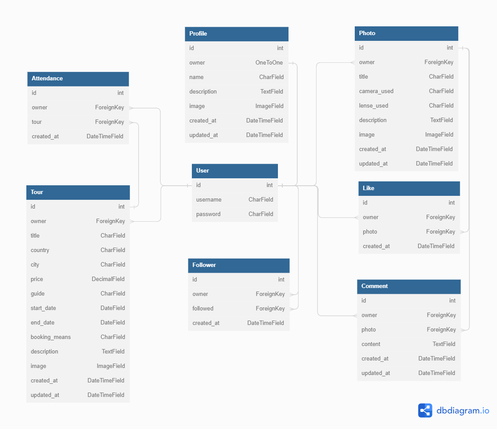
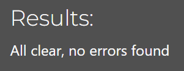
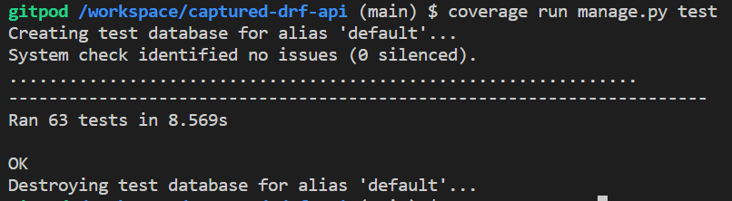
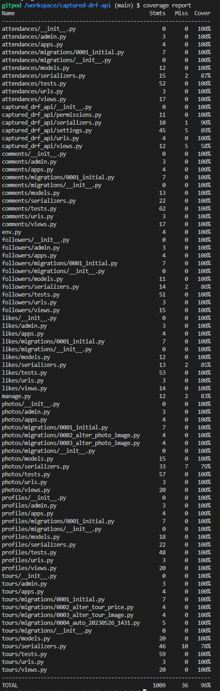

# Captured - API

Captured is a content-sharing platform for photographers. Users can showcase their own photographs along with details concerning them and interact with other users via likes, comments, and follows. The site is also used as an advertising platform for the site admin to share photographic tour opportunities that users can choose to attend.

This repository contains the backend API setup built to support the ReactJS front end and is powered by the Django Rest Framework.

#### [DEPLOYED BACKEND API](https://captured-drf-api.herokuapp.com/)
#### [DEPLOYED FRONTEND](https://captured.herokuapp.com/)
#### [FRONTEND REPOSITORY](https://github.com/Tony118g/captured)

## Contents

* [Project Goals](#project-goals)
* [User Stories](#user-stories)
* [The Database](#the-database)
* [Technologies Used](#technologies-used)
* [Testing](#testing)
    * [Code Validation](#code-validation)
    * [Manual Testing](#manual-testing)
    * [Automated Testing](#automated-testing)
    * [Known Bugs](#known-bugs)
* [Deployment and Development](#deployment-and-development)

## Project Goals
This section of the project provides a Django Rest Framework API for the [Captured React web app](https://github.com/Tony118g/captured). The primary goals that this section of the project aims to achieve are as follows:

* Provide a fully functional API for the front end to connect to and use.
* Provide a connection to necessary services along with relevant functionality to ensure correct data and media storage.
    * Create and provide access to a well-structured database.
    * Connect to Cloudinary and wire up relevant functionality for media storage.
* Include base functionality for authentication.
* Include base functionality for form validation.
* Provide the means for crud operations where necessary.

Goals pertaining to the entire project can be found [here](https://github.com/Tony118g/captured#project-goals).

## User Stories:
All User Stories for this project have been fully documented and tested in the [Captured](https://github.com/Tony118g/captured) front-end repository.

All Epics and user stories can also be found on the [project kanban board](https://github.com/users/Tony118g/projects/10).

## The Database

I used [dbdiagram.io](https://dbdiagram.io/home) to create a visual representation of the database.

### The User Model
* This model contains information about the user and is part of the Django allauth library.
* It has a one-to-one relationship with the profile model owner field.
* It has ForeignKey relationships with the following:
    * Follower model owner and followed fields.
    * Photo model owner field.
    * Comment model owner field.
    * Like model owner field.
    * Attendance model owner field
    * Tour model owner field

### The Profile Model
* This model contains the following fields:
    * owner
    * name
    * description
    * image
    * created_at
    * updated_at
* The owner field has a one-to-one relationship with the User model.

### The Photo Model
* This model contains the following fields:
    * owner
    * title
    * camera_used
    * lense_used
    * description
    * image
    * created_at
    * updated_at
* It has a ForeignKey relationship between the owner field and the User model.
* It has a ForeignKey relationship with the Comment model photo field.
* It also has a ForeignKey relationship with the Like model photo field.

### The Tour Model
* This model contains the following fields:
    * owner
    * title
    * description
    * country
    * city
    * price
    * guide
    * start_date
    * end_date
    * booking_means
    * image
    * created_at
    * updated_at
* It has a ForeignKey relationship between the owner field and the User model.
* It has a ForeignKey relationship with the Attendance model tour field.

### The Follower Model
* This model contains the following fields:
    * owner
    * followed
    * created_at
* It has a ForeignKey relationship between the owner field and the User model.
* It also has a ForeignKey relationship between the followed field and the User model.

### The Comment Model
* This model contains the following fields:
    * owner
    * photo
    * content
    * created_at
    * updated_at
* It has a ForeignKey relationship between the owner field and the User model.
* It also has a ForeignKey relationship between the photo field and the Photo model.

### The Like Model
* This model contains the following fields:
    * owner
    * photo
    * created_at
* It has a ForeignKey relationship between the owner field and the User model.
* It also has a ForeignKey relationship between the photo field and the Photo model.

### The Attendance Model
* This model contains the following fields:
    * owner
    * tour
    * created_at
* It has a ForeignKey relationship between the owner field and the User model.
* It also has a ForeignKey relationship between the tour field and the Tour model.

NB - Serializers were used to add extra fields to some of these models to improve functionality such as the profile_id and profile_image fields.

## Technologies Used

### Languages
* [Python](https://en.wikipedia.org/wiki/Python_(programming_language))
    * The programming language used.

### Libraries and Frameworks
* [Django REST Framework](https://www.django-rest-framework.org/)
    * The framework used to create the API.
* [Django](https://pypi.org/project/Django/)
    * The framework used to help develop the project API.

### Packages
* [Pillow](https://pillow.readthedocs.io/en/stable/)
    * Used for image processing and validation.
* [asgiref](https://pypi.org/project/asgiref/)
    * A standard for Python asynchronous web apps and servers to communicate with each other.
* [dj-database-url](https://pypi.org/project/django-database-url/)
    * Used to parse the database URL in the production environment.
* [dj-rest-auth](https://pypi.org/project/dj-rest-auth/)
    * Used for handling authentication securely in the Django Rest Framework.
* [django-allauth](https://pypi.org/project/django-allauth/)
    * Used for the site's authentication system.
* [django-cors-headers](https://pypi.org/project/django-cors-headers/)
    * Used for cross-origin resource sharing (CORS) headers to responses.
* [django-filter](https://pypi.org/project/django-filter/)
    * Used to add queryset filtering.
* [djangorestframework-simplejwt](https://pypi.org/project/djangorestframework-simplejwt/)
    * A JSON Web Token authentication plugin for the Django REST Framework.
* [oauthlib](https://pypi.org/project/oauthlib/)
    * A framework that implements the logic of OAuth1 or OAuth2 without assuming a specific HTTP request object or web framework.
* [psycopg2](https://pypi.org/project/psycopg2/)
    * Used as a PostgreSQL database adapter for the Python programming language.
* [PyJWT](https://pypi.org/project/PyJWT/)
    * Used for encoding and decoding JSON Web Tokens.
* [python3-openid](https://pypi.org/project/python3-openid/)
    * OpenID support for modern servers and consumers.
* [pytz](https://pypi.org/project/pytz/)
    * Allows accurate and cross-platform timezone calculations.
* [requests-oauthlib](https://pypi.org/project/requests-oauthlib/)
    * OAuthlib authentication support for Requests.
* [sqlparse](https://pypi.org/project/sqlparse/)
    * A non-validating SQL parser for Python.
* [django-allauth](https://pypi.org/project/django-allauth/)
    * Used for the site's authentication system.
* [gunicorn](https://pypi.org/project/gunicorn/)
    * A Python HTTP server for WSGI applications used to run the Python application concurrently.
* [django-cloudinary-storage](https://pypi.org/project/dj3-cloudinary-storage/)
    * Used to provide Cloudinary storage for media files as well as management commands for removing unnecessary files.

### Other Tools
* [Cloudinary](https://cloudinary.com/)
    * Used to store static files and media.
* [ElephantSQL](https://www.elephantsql.com/)
    * Used to host the database used in production.
* [GitHub](https://github.com/)
    * Used to store the repository.
* [Gitpod](https://www.gitpod.io/#get-started)
    * Used to create code/content and file structure for the repository.
* [Heroku](https://dashboard.heroku.com)
    * Used to host the deployed site.

### Testing

#### Code Validation

All Python code written by myself for this project was developed following PEP8 guidelines and was run through the [CI Python Linter](https://pep8ci.herokuapp.com/).

* All final Python files presented no warnings or errors.

## Manual Testing

During development, I carried out a number of manual tests to ensure the correct functionality of the API.

### For logged-out users:

**Topic** | **Permission** | **Expected Result** | **Actual Result**
-------- | ------------------- | ------------------- | -----------------
All objects | read only | All objects can only be read | Works as expected

### For logged-in normal users:

**Topic** | **Permission** | **Expected Result** | **Actual Result**
-------- | ------------------- | ------------------- | -----------------
Profile | full crud | User profile can be created, read, updated, and deleted | Works as expected
Photo | full crud | A photo post can be created, read, updated, and deleted | Works as expected
Comment | full crud | A comment can be created, read, updated, and deleted | Works as expected
Like | Create & delete | A like can be created and deleted | Works as expected
Follower | Create & delete | A follower can be created and deleted | Works as expected
Tour | read only | Tours can only be read | Works as expected
Attendance | Create & delete | An attendance can be created and deleted | Works as expected

### For logged-in admin users:

**Topic** | **Permission** | **Expected Result** | **Actual Result**
-------- | ------------------- | ------------------- | -----------------
Profile | full crud | User profile can be created, read, updated, and deleted | Works as expected
Photo | full crud | A photo post can be created, read, updated, and deleted | Works as expected
Comment | full crud | A comment can be created, read, updated, and deleted | Works as expected
Like | Create & delete | A like can be created and deleted | Works as expected
Follower | Create & delete | A follower can be created and deleted | Works as expected
Tour | full crud | Tours  can be created, read, updated, and deleted | Works as expected
Attendance | Create & delete | An attendance can be created and deleted | Works as expected

NB - All of the above tests have been carried out with the presumption that edit and delete functionality are only done on objects owned by the relevant user.

Tests for ownership permissions were also carried out:
* All objects excluding tours can only be edited and deleted by their respective owners.
* All tours cannot be edited or deleted by non-admin users.
* All tours can be edited and deleted by admin users regardless of ownership status.

### Testing list orders
The below tests were carried out to see if objects are listed in the correct order.

**Topic** | **Expected order** |**Result** 
-------- | ------------------- | ------------------- 
Profiles | newest to oldest | &check;
Photos | newest to oldest | &check;
Comments | newest to oldest | &check;
Likes | newest to oldest | &check;
Followers | newest to oldest | &check;
Tours | newest to oldest | &check;
Attendances | newest to oldest | &check;

## Automated Testing

As well as manual tests, I created automated tests for the main functionality of the project. I found this very beneficial in ensuring the site works as intended and it helped pick out a few errors that I would have missed without it.

Tests were created for each app for key features and functionality. I used [coverage](https://pypi.org/project/coverage/) to keep track of the amount of code my tests have covered and generated reports to find out which areas were untested so I could be sure to cover as much code as possible.

I created a total of 63 automated tests which all pass and provide 96% coverage for the project.

## Known Bugs

### Resolved
* As pointed out in the moments walkthrough, dj-rest-auth has a bug that doesn’t allow users to log out. You can find out more about this issue [here](https://github.com/iMerica/dj-rest-auth/issues/246).
    * The solution to this was to create a custom logout view, where necessary configurations are made to allow correct functionality.
* A few minor errors occured due to typos in code and incorrect syntaxt however these were easily amended.

### Unresolved
* No known bugs were left unresolved to the best of my knowledge.

## Deployment and Development
* The project API was developed using [Gitpod](https://www.gitpod.io/#get-started) to create the code and overall file structure.
* [GitHub](https://github.com/) is used to host the repository.

### Deployment
This project API was deployed using [Heroku](https://id.heroku.com/login).

NB - to ensure a successful deployment of the project in Heroku, you need to ensure that you create a Procfile and a requirements.txt file.

Once you are certain that everything is ready to deploy the repository, you can go through the following steps to do so:

1. Log in to Heroku or create an account if necessary.
2. Click on the button labeled "New" from the dashboard in the top right corner and select the "Create new app" option in the drop-down menu.
3. Enter a unique name for the application and select the region you are in.
    * For this API, the unique name is "captured-drf-api" and the region selected is Europe.
4. Click on "Create app".
5. Navigate to the settings tab and click "Reveal config vars".
6. Add the necessary config vars for the project.
7. Navigate to "Deploy".
8. Select "GitHub" as the deployment method and click "Connect to GitHub".
9. Search for the GitHub repository that you wish to deploy and click on "connect" to link the repository to Heroku.
10. Scroll down and click on "Deploy Branch" to manually deploy.
11. Once the app has deployed successfully, Heroku will notify you and provide a button to view the app.

NB - If you wish to rebuild the deployed app automatically every time you push to GitHub, you may click on "Enable Automatic Deploys" in Heroku.

### Forking the Repository
To copy the repository for viewing and editing without affecting the original version you can fork the repository using the following steps:

1. In the "captured-drf-api" repository, click on the "fork" tab in the top right corner.
2. Click on "create fork" to fork the repository in your own GitHub account.

### Cloning The Repository
To clone the repository through GitHub, follow these steps:

1. In the repository, select the "code" tab located at the top of the list of files.
2. Ensure "HTTPS" is selected in the dropdown menu.
3. Copy the URL under HTTPS.
4. Open Git Bash in your IDE of choice.
5. Change the working directory to the location where you want the cloned directory to be created.
6. Type "git clone" and paste the URL that was copied from the repository.
7. Press "enter" to create the clone.

### The ElephantSQL Database
[ElephantSQL](https://www.elephantsql.com/) is used to host the database for this project in production. The process to set this up is as follows:

1. Sign up or log in to ElephantSQL with your GitHub account.
2. Click on "Create New Instance".
3. Enter a name for the instance.
4. Select the "Tiny Turtle (Free)" free plan.
5. The "Tags" field can be left blank.
6. Click "Select Region".
7. Select an appropriate data center near you.
8. Click "Review".
9. Ensure that all details are correct and then click "Create instance".
10. Once created, you can return to the dashboard and click on the relevant instance to view details such as the database URL and password.

### The Cloudinary API
[Cloudinary](https://cloudinary.com/) is used in this project to store media assets and static files. This is done because Heroku does not provide reliable and suitable media file storage.

To set up Cloudinary, follow these steps:

1. Login/sign up to Cloudinary.
2. Navigate to the dashboard to view the API Environment Variable.

NB - You are able but not required to change your assigned cloud name to something more memorable.